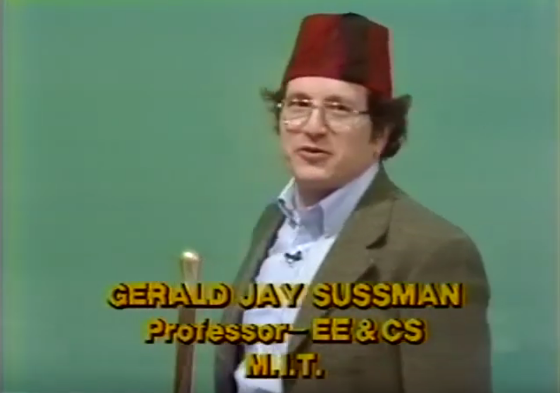
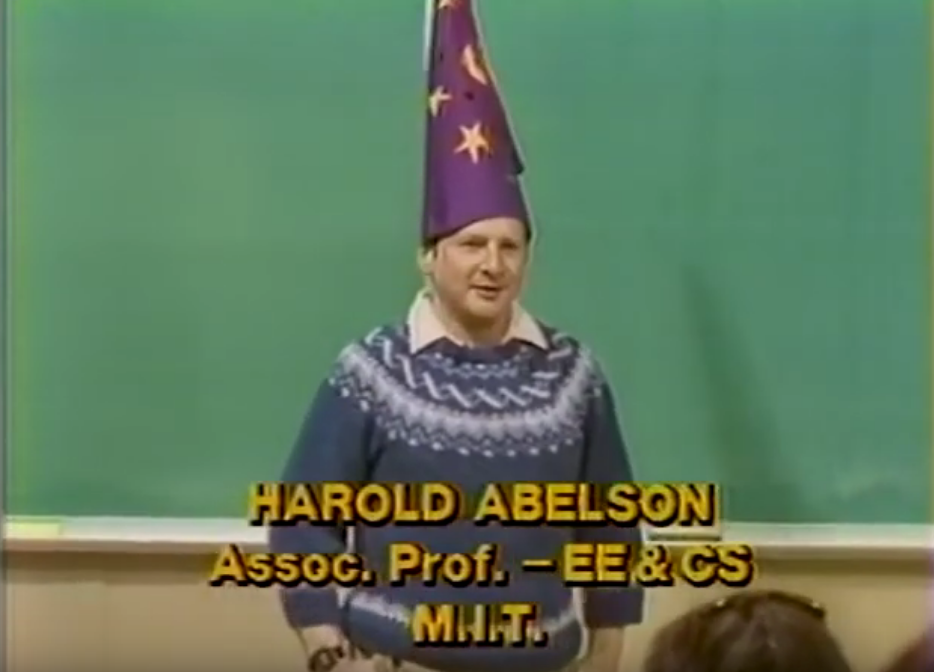

# Esse é o fim
> Ou talvez seja apenas um início.

Os interessados podem continuar seu aprendizado com os tópicos não abordados nessa oficina mas que também são ferramentas muito úteis presentes em Scheme.
Para citar algumas:

- [Interpretadores Metacirculares](https://mitpress.mit.edu/sites/default/files/sicp/full-text/book/book-Z-H-26.html)
- [Macros Higiênicas](https://en.wikipedia.org/wiki/Hygienic_macro)
- [Computação Não-Determinística](https://mitpress.mit.edu/sites/default/files/sicp/full-text/book/book-Z-H-28.html)
- [*First-class Continuations*](http://community.schemewiki.org/?call-with-current-continuation)
- [*Threads* e Concorrência](https://www.gnu.org/software/guile/manual/html_node/Threads.html)

## Agradecimentos

## Scripts Anexos

Os trechos de código utilizados na oficina podem ser encontrados no meu [repositório do GitHub](https://github.com/baioc/baioc.github.io/tree/master/seccom-scheme/src/scm).

## Discussão e Comentários

Podem utilizar o espaço abaixo para tirar dúvidas e discutir implementações, assim como apontar quaisquer erros no conteúdo.

Sinta-se também à vontade para deixar sua opinião sobre a oficina, elogiando ou criticando de forma construtiva.

{{#include disqus.html}}
